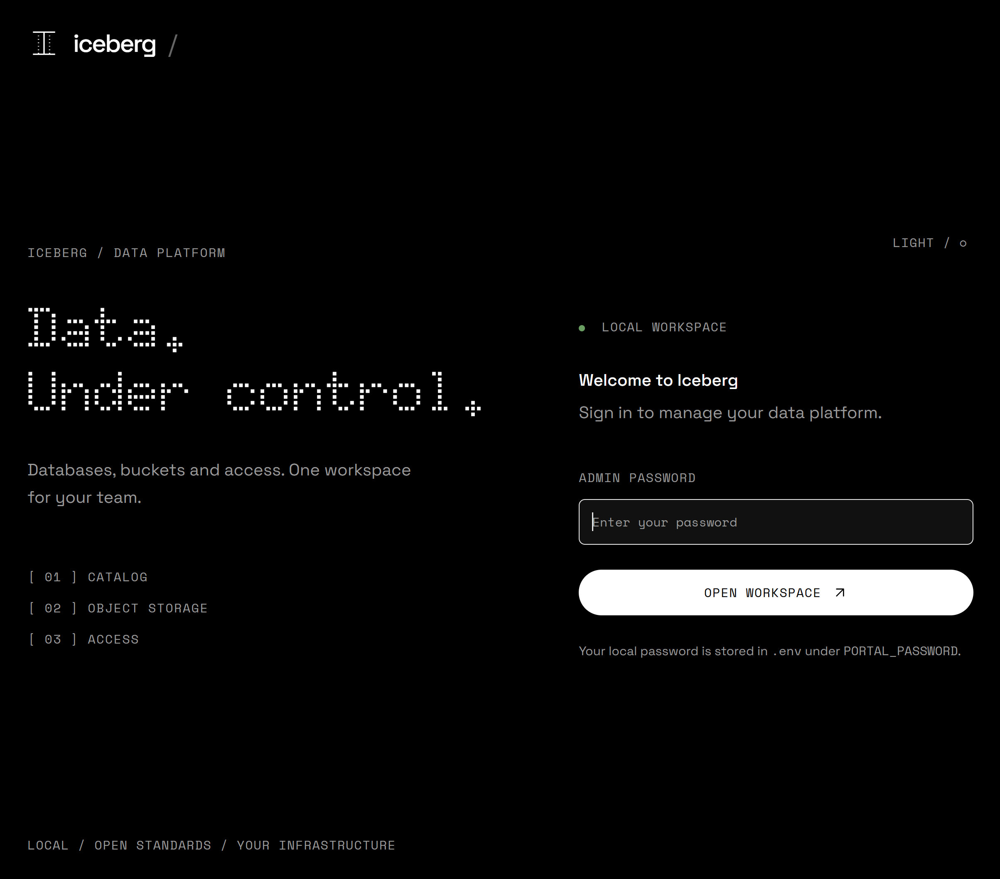

# Iceberg Data Platform

A local platform for managing team access to Apache Iceberg and exploring data in shared team marimo notebooks. It combines two FastAPI portals with Keycloak, Apache Polaris, PostgreSQL and RustFS.




**Independent project · Apache-2.0 · Python 3.14 · uv · English interface and documentation**

## What it does

- **Administration portal:** create and manage teams, assign users to one or more teams with a role per team, create databases, move databases between teams, and delete databases with their stored data.
- **Administrator catalog explorer:** browse all Polaris catalogs, nested namespaces, tables and views. Database-admin roles do not grant portal-admin access.
- **Separate user portal:** sign in with Keycloak, switch teams and browse the active team's databases.
- **User catalog details:** inspect table schemas, snapshots, branches/tags, partitioning, sort orders and view SQL; preview up to 100 rows at a selected snapshot with your own data permissions.
- **Shared team workspaces:** one shared filespace per team and environment, with isolated execution using each user's data permissions.
- **Three included examples:** create 26,880 synthetic energy measurements with PyIceberg, visualize them with DuckDB, or attach Polaris directly for native DuckDB queries on Iceberg.

The platform uses two Compose projects: **iceberg-platform** for the admin portal,
Keycloak and data services, and **iceberg-workspaces** for the user portal and notebooks.
Keycloak manages sign-in and identity; Polaris manages team and database permissions.
This is a **local development platform**, with in-memory sessions and a trusted Docker
gateway. Read [the security model](SECURITY.md) before deploying elsewhere.

## Quick start

### Install a released version (Docker only)

Install and start Docker with Compose v2 first (Docker Desktop on macOS/Windows, using Linux containers).

**Linux / macOS**

```bash
curl -fsSL https://github.com/sanderdw/iceberg-data-platform/releases/latest/download/install.sh | sh
```

**Windows PowerShell**

```powershell
irm https://github.com/sanderdw/iceberg-data-platform/releases/latest/download/install.ps1 | iex
```

The installer creates `~/iceberg-data-platform`, prepares `.env`, pulls application
images and starts both projects. To test this branch before a stable release, use the
Keycloak preview below. See the
[installation guide](docs/install.md) for configuration and updates.

### Try the Keycloak branch (Docker only)

After the branch's first successful `Release` workflow, testers can run:

```bash
curl -fsSL https://github.com/sanderdw/iceberg-data-platform/releases/download/keycloak-preview/install.sh | sh
```

On Windows PowerShell:

```powershell
irm https://github.com/sanderdw/iceberg-data-platform/releases/download/keycloak-preview/install.ps1 | iex
```

Every successful push to `keycloak` publishes a tested preview with matching AMD64
and ARM64 images. The same command picks up new previews when rerun; installations
do not update automatically. Stable releases remain unchanged. Start with a fresh
installation: preview and stable use the same Docker project names and ports, so
use a separate Docker environment to run both. The initial administrator credentials
are in `~/iceberg-data-platform/.env`; no demo users or data are created.

### Run from source

Requirements: Docker Engine or Docker Desktop with Compose v2, [uv](https://docs.astral.sh/uv/getting-started/installation/), and enough Docker memory for the data stack plus notebooks (budget at least 4 GiB for a small demonstration). Node.js 24+ is only needed for development and browser tests.

From a checkout or extracted source release:

```bash
uv python install
uv sync --locked --all-groups
uv run python -m scripts.setup
docker compose up -d --build --wait
docker compose -f compose.users.yaml --profile images build
docker compose -f compose.users.yaml up -d --build --wait users
```

Setup generates random development credentials in `.env`, sets restrictive file permissions, and preserves an existing `.env`. Do not commit or share this file.


| Service                  | URL                               | Login                                                     |
| ------------------------ | --------------------------------- | --------------------------------------------------------- |
| Administration portal    | http://localhost:3000             | `platform-admin` + initial `PLATFORM_ADMIN_PASSWORD`       |
| Keycloak console         | http://localhost:8080/admin        | `admin` + `KEYCLOAK_ADMIN_PASSWORD`                         |
| User portal              | http://localhost:3002             | Keycloak account created or linked by an administrator                  |
| Polaris Iceberg REST API | http://localhost:8181/api/catalog | Keycloak bearer token (native credentials for services)    |
| RustFS console           | http://localhost:9001             | Issued bucket-admin credentials or local root credentials |
| pgAdmin                  | http://localhost:5050             | `PGADMIN_EMAIL` + `PGADMIN_PASSWORD` from `.env`            |

All default host ports bind to `127.0.0.1`. PostgreSQL is internal only. The portal's authenticated API documentation is available at `/docs` on port 3000.

pgAdmin includes a **Polaris metadata** server connection. Enter `POSTGRES_PASSWORD` from `.env` when connecting to the database. PostgreSQL 18 stores its data in the persistent `postgres18-data` volume. See the [administration guide](docs/admin-guide.md#postgresql-and-pgadmin) for configuration details.

### First session

1. Open the administration portal, sign in with Keycloak as `platform-admin` and change the temporary password.
2. Create a team, create a database under that team, then create a user with membership of that team. Choose **Read & write** (writer) for that team to run the examples that write data.
3. Copy the temporary password shown once. Open the user portal on port 3002, sign in through Keycloak, and change that password.
4. Select a team and database. Choose **01 · Neighborhood data with PyIceberg**, run the cells with ▶ and click **Create example table**.
5. Use the notebook selector to open **02 · Visualize with DuckDB**. Run its cells and change the street filter to explore energy consumption and solar production.
6. Open **03 · Native DuckDB on Iceberg** and click **Connect / refresh credentials** to query the Iceberg table directly, inspect snapshots and run SQL aggregations.

The first example skips a table that already contains rows. Readers can use the second example once a writer has created the dataset. Saved notebooks are shared per team and environment (Development, Acceptance or Production), across databases. Switching context or logging out stops only your execution; save your work first. Adding starter examples never overwrites existing team files.

### Optional LAN access

The `.lan.yaml` files only adjust host bindings. Keycloak access beyond localhost
requires HTTPS and matching issuer/redirect configuration; see
[Keycloak configuration](docs/keycloak.md#configuration).

## Development and tests

The toolchain uses Python **3.14.7**, FastAPI **0.141.1**, marimo **0.24.2** and uv **0.12.13**. Python dependencies are locked in `uv.lock`; browser tooling is locked in `package-lock.json`.

```bash
uv sync --locked --all-groups
npm ci
npm run verify
npm run check:release
uv run --all-groups marimo check user_portal/notebook/template.py user_portal/notebook/examples/*.py
```

For live reload, start the data services and run the administration backend locally:

```bash
docker compose up -d --build --wait
uv run python -m server --reload
```

With the two projects running, [create optional test fixtures](docs/keycloak.md#verification-and-optional-demo-data), then run:

```bash
npx playwright install chromium
npm run test:keycloak
```

CI also tests the native Polaris APIs using isolated application factories. These test
fixtures are separate from the shipped Keycloak entrypoints.

Tests cover authorization, team membership, compensating actions, resumable deletion, real Iceberg reads/writes, notebook isolation, persistence, SQL results and browser interaction. Live tests create unique resources and clean up only their own data. The Docker SDK integration follows the active Docker CLI context, including Docker Desktop.

## Documentation

- [Keycloak identity and access management](docs/keycloak.md) — setup, existing-instance upgrades, user lifecycle, data access and session limits.
- [Users, teams, memberships, roles and database definitions](docs/CONTEXT.md)
- [Architecture and repository layout](docs/architecture.md)
- [Administration guide](docs/admin-guide.md)
- [User portal and notebooks](user_portal/README.md)
- [Contributing](CONTRIBUTING.md)
- [Security and deployment boundaries](SECURITY.md)
- [Publishing a release](docs/releasing.md)
- [Presentation](https://sanderdw.github.io/iceberg-data-platform/) — reveal.js deck about the platform; its source lives in `presentation/`, which is not part of source releases
- [Changelog](CHANGELOG.md)

## License

Application source is licensed under [Apache-2.0](LICENSE). Bundled fonts retain their [third-party licenses](THIRD_PARTY_NOTICES.md). This is an independent project and is not an Apache Software Foundation project.
