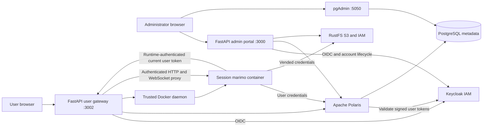

# Architecture

## Services and ownership

`compose.yaml` runs **iceberg-platform**: the admin portal, Keycloak, PostgreSQL 18,
pgAdmin, RustFS, Polaris and monitoring. Startup configures Keycloak provisioning before
the admin portal becomes available. `compose.users.yaml` runs **iceberg-workspaces**:
the user gateway and notebook image build. The gateway joins the platform network,
uses Keycloak for sign-in and talks directly to Polaris and RustFS. It can restart
independently of the platform and has no dependency on the admin portal API.

Authentication and account management live in `server/oidc.py`, `server/identity.py`
and `server/entrypoints.py`. Both standard application images include OIDC support.
The installed portals always use Keycloak authentication.

Both portals keep OIDC grants in process memory and renew access tokens before expiry,
revalidating identity and required roles. Sessions last at most eight hours and also
depend on Keycloak's session limits. Refresh tokens never reach browsers or notebooks.
Notebook connection helpers retrieve the owner's current access token from an internal
gateway endpoint authenticated with that runtime's credential. PyIceberg retrieves it
for each REST request; existing DuckDB attachments must reconnect to replace cached
credentials. Successful renewal keeps the notebook running.

Teams are marked Polaris principal-role records. Users are Polaris principals with stable team IDs, a role per team, an individual principal role and, per database, the grant that matches their role in the owning team. Databases are Iceberg REST catalogs backed by dedicated RustFS buckets. There is no second application metadata database.

The admin identity manages metadata and grants. The user gateway uses that identity to resolve the directory and to create, edit and revoke [data shares](CONTEXT.md#data-shares) for team administrators, whose role it re-reads from Polaris on every such request. Catalog browsing uses the user's OAuth token. Notebook containers receive the user's own credentials. A user may belong to several teams; the active team and environment control the UI and workspace context, while the credentials retain the union of the user's team grants, each at the role held in that team.

## Notebook lifecycle

A workspace has one shared volume per team/environment, keyed by the stable team ID and environment. Environments are Development, Acceptance and Production. All team members and databases in an environment share the same files. On first use the gateway creates the volume; on each runtime start, missing starter files are added without replacing existing files. Marimo serves the directory for browsing shared notebooks and examples.

Database display names are unique within a team and environment. Each database has an opaque, stable catalog ID used in REST paths and connection settings, so `db1` can exist in both Development and Production. Moves preserve the catalog ID and bucket, and reject name conflicts at the destination. Files stay with their team/environment when a database moves; no notebook migration is performed.

Each session/database execution receives its own container and Docker bridge network containing the runtime, gateway, Polaris and RustFS, with outbound internet access for package installs and external services. Runtime ports are not published. Additional Python packages install into `/tmp/packages`, which is on the runtime's Python import path and is discarded when the container stops. HTTP and WebSocket requests must belong to the authenticated session, active team and environment. Portal cookies and caller Authorization headers are stripped before forwarding to marimo.

Runtime containers run as UID 10001 with a read-only root filesystem, a writable work volume and temporary filesystem, dropped capabilities, no privilege escalation, and CPU/memory/process limits. They do not receive the Docker socket or platform-admin secrets. The gateway itself is trusted and has Docker-host administrative access.

Logout, team or environment switching, expiry and revoked authorization stop only the affected session’s runtimes. A gateway restart invalidates in-memory sessions and removes that stack's orphan runtimes and networks. Shared team/environment volumes persist. Multiple gateway replicas are not supported.

## Repository layout

The internal `monitor` service polls health endpoints, Docker container statistics,
PostgreSQL statistics and S3 object listings independently. It keeps bounded probe
history and cached snapshots in memory. The admin API authenticates requests to
`/api/infrastructure` and fetches the snapshot using a server-side shared secret.
This read bypasses the administration mutation lock and does not depend on Polaris
being healthy. Source failures retain the last successful sample with an explicit
unavailable status. The collector returns only selected metrics, never Docker
inspection documents, SQL text, connection strings or upstream error bodies.

The collector has no host port, mounts RustFS data read-only for filesystem capacity,
and reads Docker via its Unix socket. Its root filesystem is read-only and Linux
capabilities are dropped. Docker socket access still makes it a trusted service
with host-level capability; the portal itself has no Docker socket. PostgreSQL
queries use read-only transactions and statement/connect timeouts. The local
Compose setup reuses the PostgreSQL account; a separately provisioned monitoring
account can be configured through `PGHOST`, `PGDATABASE` and `PGUSER` with its password
in the collector's `POSTGRES_PASSWORD` environment variable.

| Path | Purpose |
| --- | --- |
| `server/` | Administration API, domain validation, Polaris and RustFS adapters |
| `public/` | Admin UI and canonical shared fonts/favicon |
| `user_portal/` | User API, authentication, notebook lifecycle and proxy |
| `user_portal/public/` | User interface; shares canonical assets with `public/` |
| `user_portal/notebook/` | Runtime image, connection helper and starter seeding |
| `user_portal/notebook/examples/` | Editable PyIceberg and DuckDB examples, including Iceberg v3 write and read |
| `scripts/` | Credential setup, integration checks and source release tooling |
| `pgadmin/` | Preconfigured PostgreSQL metadata connection for pgAdmin |
| `test/` | Unit, authorization and browser tests |
| `docs/` | Operating and release documentation |
| `.github/` | CI and contribution templates |

The supported public examples are the marimo notebooks. Historical Jupyter experiments, private credentials and generated evidence are not part of the source release. The `presentation/` deck is tracked in git and published to GitHub Pages by the `Pages` workflow, but it is excluded from the source release as well.
