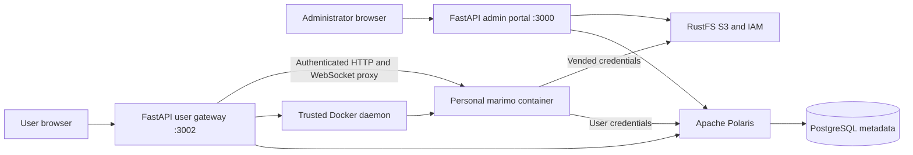

# Architecture

## Services and ownership

`compose.yaml` runs the `iceberg-platform` project: PostgreSQL, RustFS, Polaris bootstrap, Polaris and the admin portal. `compose.users.yaml` runs the `iceberg-workspaces` gateway separately and provides the notebook image build. The gateway joins the existing catalog network; it does not depend on the administration portal's API.

Teams are marked Polaris principal-role records. Users are Polaris principals with stable team IDs, an individual principal role and the grants of their teams. Databases are Iceberg REST catalogs backed by dedicated RustFS buckets. There is no second application metadata database.

The admin identity manages metadata and grants. The user gateway uses that identity only to resolve the directory, then uses the user's OAuth token for catalog browsing. Notebook containers receive the user's own credentials. A user may belong to several teams; the active team controls the UI and workspace context, while the credentials retain the union of the user's team grants.

## Notebook lifecycle

A workspace has one private volume per user/team/database. On start, missing starter files are copied to that volume. Existing files are preserved. Marimo serves the directory so the user can select their own notebook or either example.

Each workspace receives its own internal Docker network containing the runtime, gateway, Polaris and RustFS. Runtime ports are not published. HTTP and WebSocket requests must belong to the authenticated session and active team. Portal cookies and caller Authorization headers are stripped before forwarding to marimo.

Runtime containers run as UID 10001 with a read-only root filesystem, a writable work volume and temporary filesystem, dropped capabilities, no privilege escalation, and CPU/memory/process limits. They do not receive the Docker socket or platform-admin secrets. The gateway itself is trusted and has Docker-host administrative access.

Logout, team switching, expiry and revoked authorization stop runtimes. A gateway restart invalidates in-memory sessions and removes that stack's orphan runtimes and networks. Personal volumes persist. Multiple gateway replicas are not supported.

## Repository layout

| Path | Purpose |
| --- | --- |
| `server/` | Administration API, domain validation, Polaris and RustFS adapters |
| `public/` | Admin UI and canonical shared fonts/favicon |
| `user_portal/` | User API, authentication, notebook lifecycle and proxy |
| `user_portal/public/` | User interface; shares canonical assets with `public/` |
| `user_portal/notebook/` | Runtime image, connection helper and starter seeding |
| `user_portal/notebook/examples/` | Editable PyIceberg and DuckDB examples |
| `scripts/` | Credential setup, integration checks and source release tooling |
| `test/` | Unit, authorization and browser tests |
| `docs/` | Operating and release documentation |
| `.github/` | CI and contribution templates |

The supported public examples are the marimo notebooks. Historical Jupyter experiments, private credentials, presentation assets and generated evidence are not part of the source release.
