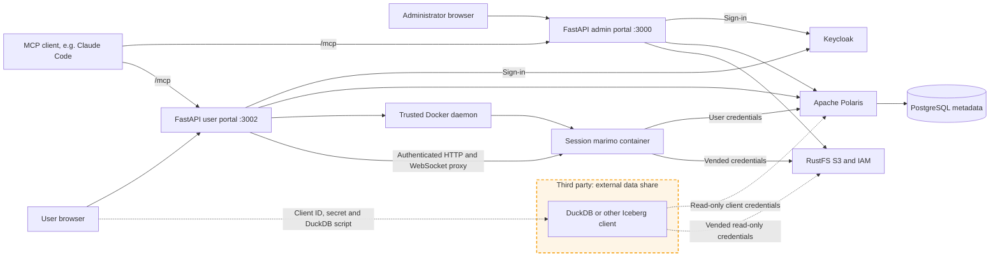

# Architecture

The third party never signs in to a portal. A team administrator hands over the share credential, and the recipient reads only the shared tables through Polaris and RustFS.

## Services

| File | Project | Services |
| --- | --- | --- |
| `compose.yaml` | `iceberg-platform` | Admin portal, Keycloak, Polaris, PostgreSQL, RustFS, pgAdmin, monitoring |
| `compose.users.yaml` | `iceberg-workspaces` | User portal, plus the notebook image build |

- **Keycloak** signs in people and MCP clients. **Polaris** holds all application metadata (teams, users, databases, shares) and enforces data permissions; see the [resource model](CONTEXT.md). There is no separate application database.
- **The user portal** joins the platform network and doesn't depend on the admin portal. Catalog browsing and notebooks use the signed-in user's own token. The portal uses its platform identity only for directory lookups and for the database and share actions of team administrators.
- **Both portals** keep sessions in memory for up to eight hours and serve `/mcp` for MCP clients, which authenticate every request with their own bearer token.

## Notebooks

- Each team and environment shares one filespace volume, across all its databases.
- Each session and database runs in its own container on a private network with the portal, Polaris and RustFS. The container runs as a non-root user with a read-only root filesystem and resource limits, and it never receives the Docker socket or platform secrets.
- Logging out, switching team or environment, or losing access stops that session's containers. Saved files persist.

The user portal controls Docker and is therefore a trusted service. The same goes for the internal `monitor` collector, which feeds the admin portal's Infrastructure page. See the [security model](../SECURITY.md).

## Repository layout

| Path | Purpose |
| --- | --- |
| `server/` | Administration API, OIDC, Polaris and RustFS adapters |
| `public/` | Admin UI and shared fonts/favicon |
| `user_portal/` | User API, notebook lifecycle and proxy |
| `user_portal/public/` | User interface |
| `user_portal/notebook/` | Notebook image, connection helpers and example notebooks |
| `scripts/` | Setup, integration checks and release tooling |
| `pgadmin/` | Preconfigured pgAdmin connection |
| `test/` | Unit and authorization tests |
| `docs/` | Documentation |
| `presentation/` | reveal.js deck, published to GitHub Pages and excluded from source releases |
