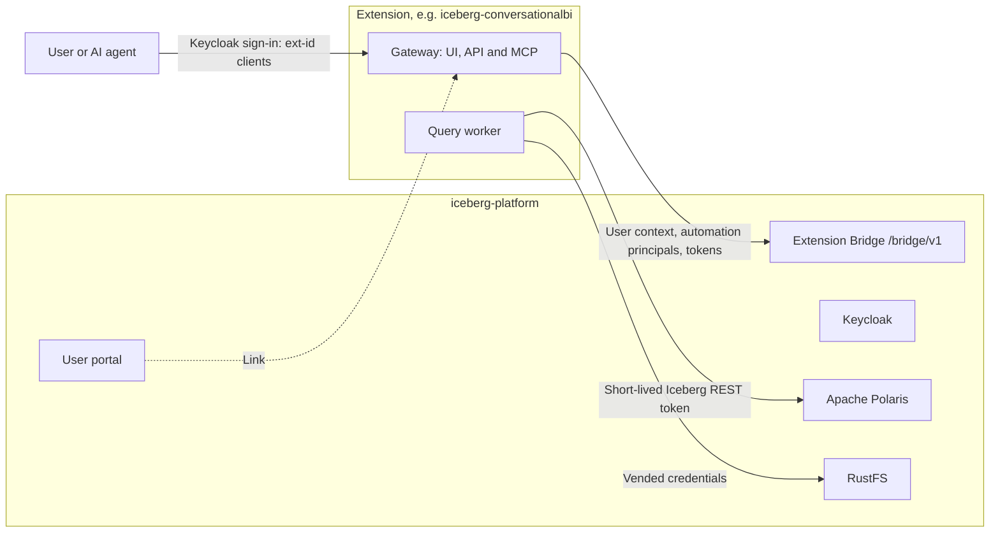

# Extensions

The core platform stays small: catalog, storage, identity, portals and notebooks. Larger
capabilities, such as conversational BI, live in **extensions**. Each one has its own Compose
project, dependencies, images, version, changelog and CI, and talks to the core only through the
**Extension Bridge**. The core and an extension are released independently and work together as
long as both support the same contract version.



## The contract

The [Extension Bridge contract](../contracts/bridge/README.md) ships with every core release. It
gives an extension the signed-in user's teams and databases, and automation principals: service
accounts that act for one team in one environment, enabled only by that team's Administrators,
with one-hour catalog tokens. Team shares the team received reach their read role. Extensions sign
in through their own Keycloak clients, whose tokens Polaris refuses. Any producer may describe a
table with the [table-property conventions](../contracts/bridge/v1/table-properties.md), which the
catalog shows as **Produced by**. See the [resource model](CONTEXT.md#automation-principals) for how
automation principals are stored, and [COMPATIBILITY.md](../contracts/bridge/COMPATIBILITY.md) for
versioning.

## Register an extension

```bash
uv run python -m scripts.setup --extension conversationalbi --origin http://localhost:3007 --handshake extensions/conversationalbi/.env.bridge
docker compose up -d --wait
docker compose -f compose.users.yaml up -d --wait users
```

Recreating the platform services creates the extension's Keycloak clients and adds a link in the
user portal. On the administration portal's Teams page, platform administrators see every
automation principal and can revoke it. `--remove-extension <id>` unregisters an extension; its
clients are disabled on the next start.

## Available extensions

| Extension | Folder | What it adds |
| --- | --- | --- |
| Conversational BI | `extensions/conversationalbi` | Ask questions about your own and shared semantic models in a chat. Answers come from governed queries compiled from the model, shown as generative UI: query cards, charts, tables and KPIs. Also an API and MCP server |

Each extension documents its own installation in its folder. The release installer can also add
Conversational BI; see [installation](install.md#add-conversational-bi).
