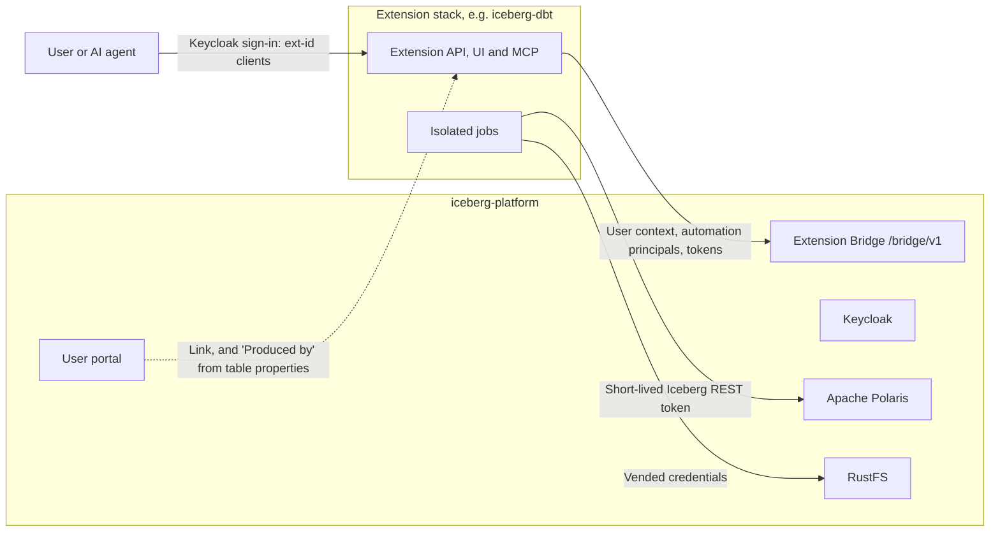

# Extensions

The core platform stays small: catalog, storage, identity, portals and notebooks. Larger
capabilities, such as transformation pipelines with dbt, live in **extension stacks**. Each one has
its own Compose project, dependencies, images, version, changelog and CI, and talks to the core
only through the **Extension Bridge**. Either side can be upgraded, as long as both support the same
contract version.



## The contract

The contract lives in `contracts/bridge` and ships with every core release:

- **Bridge API** (`contracts/bridge/v1/openapi.yaml`): discovery, the signed-in user's teams and
  databases, automation principals and their short-lived catalog tokens.
- **Identity:** each extension has two Keycloak clients, `ext-<id>` for browser sign-in and its own
  service account, and `ext-<id>-mcp` for AI agents. Their tokens are for the `iceberg-bridge`
  audience only; Polaris refuses them.
- **Automation principals:** service accounts that act for one team in one environment with that
  team's writer access. Only team Administrators enable them. See the
  [resource model](CONTEXT.md#automation-principals).
- **Table properties:** any producer may describe a table with `comment`, producer, lineage and
  quality properties. The user portal's catalog shows them, so pipelines built by an extension are
  visible where people browse data.
- **Network and handshake:** extensions join the platform network, find services by stable aliases
  and labels, and start from one handshake file.

The compatibility policy is semantic versioning with additive minor versions and parallel major
versions (`contracts/bridge/COMPATIBILITY.md`).

## Registering an extension

```bash
uv run python -m scripts.setup --extension dbt --origin http://localhost:3004 --handshake stacks/dbt/.env.bridge
docker compose up -d --wait
docker compose -f compose.users.yaml up -d --wait users
```

Recreating the platform services creates the extension's Keycloak clients and adds a link in the
user portal. On the administration portal's Teams page, platform administrators see every
automation principal and can revoke it. `--remove-extension <id>` unregisters an extension; its
clients are disabled on the next start.

## Available extensions

| Extension | Folder | What it adds |
| --- | --- | --- |
| dbt | `stacks/dbt` | dbt v2 projects per team, runs and schedules as the team's automation principal, pipeline visualization, and an API and MCP server for AI agents |

Each extension documents its own installation in its folder.
