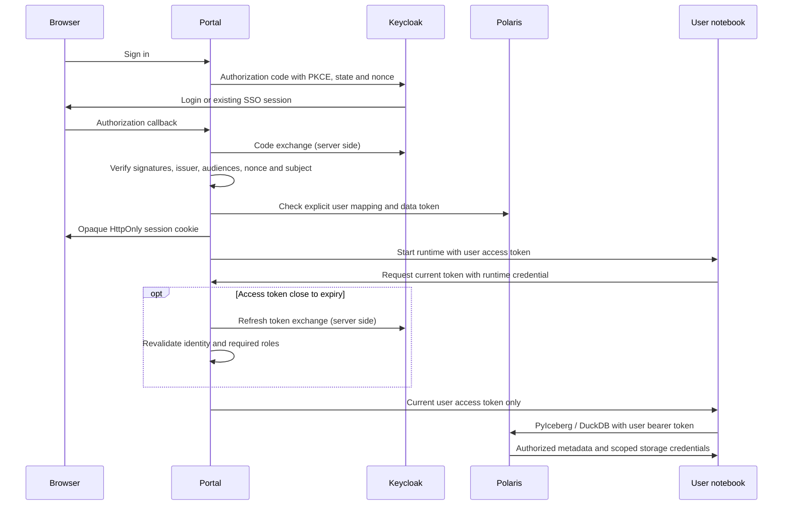

# Keycloak identity and access

Keycloak handles sign-in for both portals, notebook tokens for Polaris and MCP clients. Polaris handles teams and data permissions. Startup runs `keycloak-bootstrap`, which provisions the `iceberg` realm, its clients and the `platform-admin` account. It creates no demo users, teams or databases. To manage accounts, see the [administration guide](admin-guide.md#teams-databases-and-users).

## Configuration

`scripts.setup` derives `PORTAL_ORIGIN`, `USER_ORIGIN`, `KEYCLOAK_ORIGIN` and `OIDC_ISSUER` from `PORT`, `USER_PORT` and `KEYCLOAK_PORT`. Set the ports before the first setup. If you change a port later, you must also update the origins and the client redirect and logout URIs in Keycloak, because an existing realm is never re-imported. Issuer and redirect origins must match exactly, so use `localhost`.

Keycloak access beyond localhost needs HTTPS and matching issuer and redirect URLs. The optional `.lan.yaml` Compose files only change host bindings.

To run a portal directly from source, stop its Compose service (`portal` or `users`) and run `uv run python -m server` or `uv run --group users python -m user_portal`. Both read the generated `.env`.

## Authentication and data access



- **Portals** use confidential clients with the authorization code flow and PKCE. Tokens are verified against JWKS (RS256). The browser only receives an opaque session cookie. Refresh tokens stay in server memory and never reach browsers or notebooks.
- **Portal administration** requires the `iceberg-admin` client role `platform-admin`. A role with a similar name in another client doesn't count.
- **Polaris** runs in mixed mode. User tokens carry a `polaris.principal_name` claim naming the linked `portal-…` principal. Only realm administrators can edit that attribute. The gateway also checks the Keycloak issuer and subject stored on the principal. `PRINCIPAL_ROLE:ALL` activates only the roles Polaris already granted. Client-secret authentication remains for service identities and data shares.
- **MCP clients** such as Codex, GitHub Copilot and Claude Code use the public `iceberg-mcp` client: PKCE and no secret. Its redirects are `http://localhost:<MCP_CALLBACK_PORT>/callback`, `http://localhost/*` and `http://127.0.0.1/*`. For an http loopback address, Keycloak ignores the port, so agents can use their own callback port and path (RFC 8252) and never a remote host. Both portals accept only tokens with `azp = iceberg-mcp` on `/mcp`, so portal tokens are refused there, and they authorize every call. The admin endpoint also needs `platform-admin`, which comes from the client's `roles` default scope. Keep token exchange disabled.
- **Tools on the user's computer** use the public `iceberg-cli` client with the device authorization grant: no secret and no redirect. The user approves a code in the browser, and the downloadable `iceberg_connect.py` helper then calls Polaris and RustFS directly with the user's token. Only Polaris grants apply on that path. The gateway's issuer and subject check doesn't. Access tokens of this client last one hour, so DuckDB and DBeaver sessions don't expire after 15 minutes.

## Deployment boundaries

- Access tokens last 15 minutes and renew automatically. Portal sessions last at most eight hours, or less if Keycloak refuses renewal.
- Notebooks fetch their owner's current token from the gateway. PyIceberg picks it up automatically. A native DuckDB attachment must reconnect to renew it.
- Signing out ends that portal's session and its notebooks, then signs out of Keycloak. There is no back-channel logout. A session in the other portal, a copied token or vended S3 credentials stay valid until they expire. Disabling an account or removing its admin role doesn't invalidate tokens that were already issued.
- MCP clients and `iceberg_connect.py` keep an offline refresh token on the user's machine. It is valid for 30 days of inactivity. Revoke it in Keycloak under the user's offline **Sessions**, or with `uv run iceberg_connect.py logout`.
- Sessions are in memory, so each portal needs a single replica.
- Keycloak runs in `start-dev` mode with a local database. Production needs HTTPS, a persistent database, backups, MFA, key rotation and audit events.

## Demo fixtures

The Keycloak browser tests need optional demo accounts on a development stack:

```bash
uv run python -m scripts.setup --demo
docker compose run --build --rm keycloak-bootstrap --demo
```

This creates `demo-admin`, `demo-writer`, `demo-reader` and `demo-outsider`, with their `DEMO_*_PASSWORD` credentials in `.env`. Writers and readers can access `demo-demo`. `demo-private` belongs to another team, and the outsider has no platform identity. See [Contributing](../CONTRIBUTING.md#tests) for the tests that use them.

## References

- [Keycloak server administration](https://www.keycloak.org/docs/latest/server_admin/index.html)
- [Polaris external identity providers](https://polaris.apache.org/releases/1.7.0/managing-security/external-idp/)
