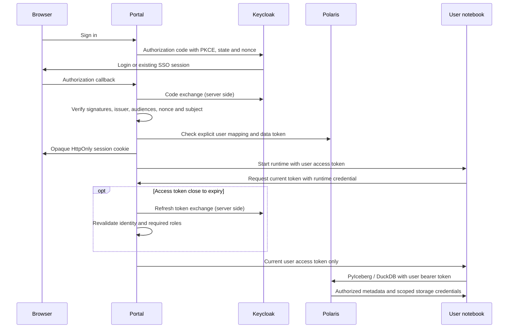

# Keycloak identity and access management

Keycloak provides sign-in for both portals and user-token authentication for Polaris
and notebooks. The platform keeps its original two Compose projects:

| File | Project | Services |
| --- | --- | --- |
| `compose.yaml` | `iceberg-platform` | Admin portal, Keycloak, Polaris, PostgreSQL, RustFS, pgAdmin and monitoring |
| `compose.users.yaml` | `iceberg-workspaces` | User portal and notebook image; on-demand notebooks |

The workspace gateway joins the platform network and uses the same Keycloak realm
and Polaris permissions. It can stop and restart independently. The `.lan.yaml` files
are optional network overrides, not additional stacks.

## Start from source

```bash
uv sync --locked --all-groups
uv run python -m scripts.setup
docker compose up -d --build --wait
docker compose -f compose.users.yaml --profile images build
docker compose -f compose.users.yaml up -d --wait users
```

The profile build includes both the user portal and notebook image, so the following
`up` command does not need `--build`. See [Run from source](../README.md#run-from-source)
for rebuilding after source changes.

Setup generates `.env` and the initial realm configuration. Repeating setup is safe
and does not rotate credentials for a running installation.
Platform startup automatically runs `keycloak-bootstrap` before starting the admin
portal. Bootstrap configures the provisioning service account and protected identity
attributes. It creates no demo users, teams or databases. Standard application images
contain all authentication code.

The install starts with one `platform-admin` account: sign in with `PLATFORM_ADMIN_PASSWORD` and
change that temporary password when prompted. This grants portal administration;
data access requires an explicit platform identity link and team membership. Create
a team and database, then create or link users through the administration portal.

| Service | Default URL | Login |
| --- | --- | --- |
| Administration portal | http://localhost:3000 | `PLATFORM_ADMIN_USERNAME` / initial `PLATFORM_ADMIN_PASSWORD` |
| User portal | http://localhost:3002 | Keycloak account created or linked in the admin portal |
| Keycloak console | http://localhost:8080/admin | `admin` / `KEYCLOAK_ADMIN_PASSWORD` |
| Polaris | http://localhost:8181/api/catalog | User's Keycloak bearer token |
| pgAdmin | http://localhost:5050 | `PGADMIN_EMAIL` / `PGADMIN_PASSWORD` |

All published ports bind to loopback. Use `localhost`: issuer and redirect origins
must match exactly. Generated realm files are under `.local/keycloak/` and contain
environment placeholders for secrets.

### Configuration

Setup derives `PORTAL_ORIGIN`, `USER_ORIGIN`, `KEYCLOAK_ORIGIN` and `OIDC_ISSUER` from
`PORT`, `USER_PORT` and `KEYCLOAK_PORT` when absent. Set ports before initial setup.
Changing a port later also requires updating origins and the client redirect/logout
URIs in Keycloak. Existing realm imports are skipped; regenerating the import file
does not change an existing realm.

Direct source runs use the same generated `.env`: `uv run python -m server` and
`uv run --group users python -m user_portal`. Missing Keycloak configuration fails startup.
Stop the corresponding Compose service (`portal` or `users`) first to free its port;
see [development instructions](../README.md#development-and-tests).

### Docker-only installation bundles

The generated bundle contains the same two Compose files, using published application
images. The installers generate Keycloak configuration, start the platform, then start
the workspace project. Platform startup includes realm provisioning automatically.
A [branch preview installer](install.md#test-a-branch) becomes available after the
first successful publication of that branch, without merging into `main`.

## Manage users in the administration portal

Use **Users** at http://localhost:3000 for routine account management:

1. **Create user → Create Keycloak account**: enter a username, first and last name,
   email, teams and data role. The portal creates both identities and their explicit
   link. Copy the temporary password from the result and share it securely; it is
   shown once and the user must change it at first sign-in at http://localhost:3002.
   Email invitations and password recovery email are not configured by default.
2. **Create user → Link existing account**: search the exact Keycloak username and
   select the account. Assign a platform username, teams and a data role per team. The account's
   password stays unchanged. Matching names never cause an automatic link.
3. **Edit access** manages Polaris permissions: the user's teams and the role in each
   team. A data administrator role does not grant access to the administration portal.
4. **Reset password** issues another temporary password for accounts created by this
   portal. Accounts linked from elsewhere retain password management in Keycloak.
5. **Revoke** removes the platform identity, its Polaris grants and Keycloak platform
   attributes. The Keycloak account itself remains, including access to other apps.
   Active user sessions are rejected on their next authorization check; notebook
   shutdown is attempted by the gateway's 30-second sweep. Previously issued S3
   credentials may remain valid until expiry. The underlying account is never
   automatically deleted or globally logged out.

If setup fails partway through, click **Refresh Users**, then **Retry setup** or
**Revoke** on the incomplete row. Retry reuses the saved operation and account;
if a successful password result was lost, **Reset password** recovers access.
Incomplete revocation stays visible so **Revoke** can retry cleanup.
These operations require one portal replica, as do the existing portal mutations.

The portal uses the `iceberg-provisioner` service account in the `iceberg` realm,
with `manage-users`, `view-users`, `query-users` and `view-clients` permissions.
Its secret is available only to the administration portal and bootstrap, never to
the user portal or notebooks. This remains a trusted realm user administrator;
it does not use the master administrator password for routine operations.

For advanced account administration, open http://localhost:8080/admin, sign in as
`admin`, select **iceberg** in the realm selector, then open **Users**. Platform accounts are in this realm, not in `master`. Portal-administrator assignments remain
an explicit Keycloak action: the `iceberg-admin` client role `platform-admin`.
Revoke refuses accounts with that role; remove it in Keycloak first. Existing admin
sessions recheck the administrator role when renewing their access token; this does not implement immediate admin
session revocation. If Keycloak is unavailable, administrator-role verification can
prevent revocation from starting; retry when it recovers.

## Authentication and data access



- Authorization code flow uses a confidential client, PKCE S256, five-minute server-side
  transactions, browser-bound state, nonce and single-use callbacks. No password grant
  is enabled for portal clients. Bootstrap alone uses the local Keycloak administrator
  to provision the platform realm through its Admin API.
- ID tokens and access tokens are verified with JWKS and RS256. The browser receives
  only an opaque session cookie; access and refresh tokens are not returned in portal APIs.
- Portal-admin authority comes from a client-specific Keycloak role. Data-admin or
  similarly named roles in another client cannot grant portal-admin access.
- User tokens carry a `polaris.principal_name` attribute managed only by Keycloak admins.
  It names the existing `portal-…` Polaris principal, not a mutable display name.
  `polaris.principal_id = 0` selects Polaris's name lookup because its management API
  does not expose numeric entity IDs. The gateway additionally checks the exact
  Keycloak issuer and subject stored on that principal, including on subsequent requests.
- `polaris.roles = ["PRINCIPAL_ROLE:ALL"]` activates only roles already granted to that
  principal in Polaris. It does not grant all platform privileges. Membership and role
  edits continue to use the existing administration portal and Polaris grants.
- Polaris runs in **mixed** mode. The gateway's internal service identity still handles
  administrative directory queries and manages data shares for team administrators;
  user catalog requests and notebook runtimes use
  that user's Keycloak access token. No platform credential or refresh token is sent
  to a notebook. PyIceberg, native DuckDB and previews all support this token path.
- The user gateway reaches Polaris through a persistent Compose-network alias,
  separate from the `polaris` alias on disposable notebook networks. Stopping a
  notebook therefore does not remove the gateway's active catalog connection.

## Verification and optional demo data

`npm run verify` runs unit and authorization tests. CI also starts both Compose
projects and tests fresh administrator onboarding, notebook access and user lifecycle.
On a development installation, optional fixtures can be created explicitly:

```bash
uv run python -m scripts.setup --demo
docker compose run --build --rm keycloak-bootstrap --demo
npm ci
npx playwright install chromium
npm run test:keycloak
```

Demo accounts are `demo-admin`, `demo-writer`, `demo-reader` and `demo-outsider`, with
`DEMO_*_PASSWORD` credentials. Writers and readers have access to `demo-demo`;
`demo-private` belongs to another team and outsider has no linked platform identity.
This fixture command preserves passwords and may recreate deleted demo accounts and
links; it is not routine startup.

Tests cover SSO, denied admin access, unlinked identities, actual Iceberg writes/reads,
reader write denial, team isolation, PyIceberg, DuckDB, preview and logout. Lifecycle
tests create a user, change the temporary password, run a notebook, revoke access and
link the preserved account again. Tests clean up their own identities. Table deletion
removes test metadata; small objects remain in storage because purge is disabled.
The onboarding test is for fresh disposable stacks only: it changes the initial
administrator password. Passwords and tokens are never printed.

## Deployment boundaries

- Access tokens last 15 minutes. Both portals retain refresh tokens only in server memory
  and renew access before expiry, so an active session does not require another sign-in
  every 15 minutes. Sessions last at most eight hours and also end when Keycloak refuses
  renewal. Each renewal validates the access token's signature, issuer, audience and
  subject; administrator roles are checked again before access is allowed.
- Active notebook sessions renew during the gateway's 30-second sweep. Notebook helpers
  obtain the current user's access token from a runtime-authenticated gateway endpoint;
  refresh tokens never leave the gateway. Existing PyIceberg catalogs use fresh tokens
  for REST requests. Reconnect a native DuckDB attachment to renew its cached access
  token and table storage credentials; doing so does not require restarting the notebook.
- Sign out first invalidates that portal session and stops its notebooks, then redirects
  to Keycloak's logout confirmation. There is no back-channel logout: an already-issued
  session in the other portal, a copied access token, or previously vended S3 credentials
  can remain valid until their respective expiry. Disabling a Keycloak account or
  removing its administrator role likewise does not immediately invalidate issued JWTs.
- Sessions and login transactions are in memory and require one replica per portal.
  Restarting the user portal stops its runtimes; saved team files persist.
- The human-account workflows do not offer direct S3/bucket-admin credentials.
  Teams and per-team data roles stay in Polaris; Keycloak groups are not synchronized.
- An incomplete new account may remain disabled in Keycloak after revocation. Review
  such abandoned accounts in Keycloak; the portal preserves accounts by design.
- Existing Polaris client-secret authentication remains available in mixed mode.
  Data shares rely on it: a share is a Polaris principal with its own client secret and
  is not a Keycloak account. OIDC-enabled portals themselves reject password/client-secret login. A future
  external-only deployment needs a separate machine-identity migration.
- Keycloak uses `start-dev` and its local development database. Production decisions
  include HTTPS, persistent PostgreSQL for Keycloak, backups, MFA, key rotation,
  audit events, revocation, availability and secret management. The user gateway still
  has the trusted Docker-socket access described in the platform security model.
- pgAdmin and the RustFS console retain their own logins. The normal Infrastructure
  view and monitoring collector are included in the integrated stack.

## Stop and preserve data

Stop workspaces first, allowing the gateway to close its notebook runtimes:

```bash
docker compose -f compose.users.yaml down
docker compose down
```

Keep the environment file and named volumes together. `down` preserves data; `down --volumes`
destroys service data. Notebook filespaces are separate volumes and remain through
routine startup and shutdown. Back up Keycloak, Polaris, RustFS and notebook volumes
before destructive maintenance.

## References

- [Keycloak documentation](https://www.keycloak.org/documentation)
- [Keycloak user administration](https://www.keycloak.org/docs/latest/server_admin/index.html)
- [Keycloak Admin REST API](https://www.keycloak.org/docs-api/latest/rest-api/index.html)
- [Keycloak containers and development mode](https://www.keycloak.org/server/containers)
- [Keycloak realm import behavior](https://www.keycloak.org/server/importExport)
- [Polaris 1.7 external identity providers](https://polaris.apache.org/releases/1.7.0/managing-security/external-idp/)
- [Polaris principal resolution implementation](https://github.com/apache/polaris/blob/apache-polaris-1.7.0/runtime/service/src/main/java/org/apache/polaris/service/auth/DefaultAuthenticator.java)
