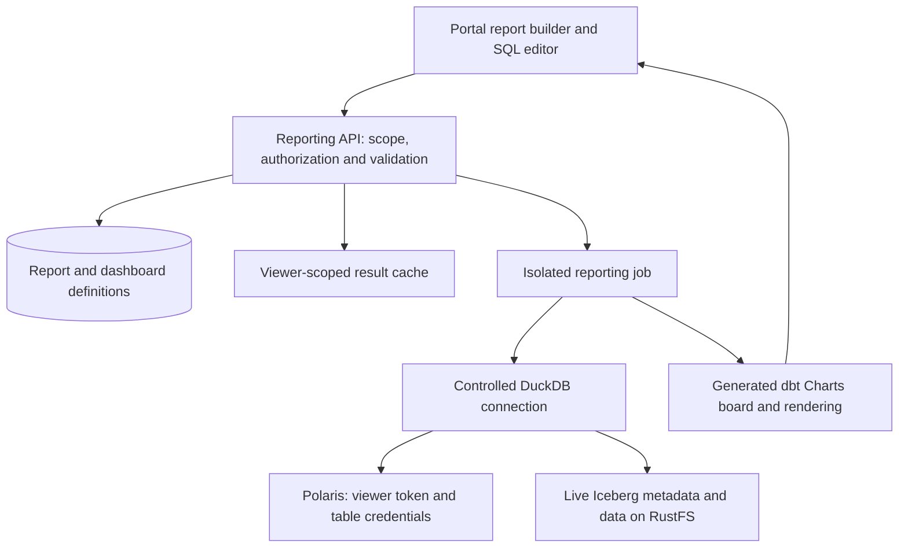

# Reports and dashboards in Iceberg Workspaces

Status: first portal implementation, 2026-09-20. Visual reports, saved dashboards and constrained SQL are implemented.

Continue with [the release roadmap and handoff](reporting-roadmap.md), which records
the current implementation, manual test setup and proposed next releases.

See [the integration results and reproduction instructions](../user_portal/reporting/README.md).
The proof selected controlled native DuckDB execution followed by a generated
dbt Charts values board: ordinary named DuckDB-profile queries in dbt Charts 0.8.0
bypass the dbt-duckdb connection plugin. The design below retains the proposed
product direction. The delivered scope below takes precedence over expansion ideas in the original design.

## Delivered scope

- Reports navigation and Create report from a catalog table, with database/namespace/table selection.
- Visual row selection, filters, count/sum/average/min/max/distinct count, two grouping dimensions, time buckets, sorting and limits.
- Table, KPI, bar, line, area and scatter output. Charts are generated by dbt Charts on the backend and displayed as SVG images; exact values remain available in the result table.
- View SQL and Edit as SQL copy, named scalar parameters and an available-columns panel. SQL queries use the selected table as `source`; approved SELECT expressions, CTEs and self-joins are supported. Multi-table SQL and visual joins are deferred.
- Saved report/dashboard definitions scoped to team/environment, immutable revisions and optimistic save conflicts. Members can create and copy; authors and team administrators can edit/delete.
- Up to eight dashboard cards, half/full widths, ordering and one shared equality filter with an explicit source-column mapping per card. Dashboard runs use the latest saved report definitions and return their revision numbers.
- Per-viewer execution and a 60-second session-scoped result cache, authorization checks on every delivery, shared per-table snapshot pinning, fresh/cached indicators, refresh and cancellation.
- Persistent SQLite definition storage on a separate gateway volume. Disposable worker containers have an internal network, resource limits and no notebook files or platform credentials.
- Unit/API tests, deterministic browser coverage, and live Polaris/RustFS smoke coverage, including Iceberg v3 and revoked access.

Not included in this release: SQL completion, arbitrary SQL functions, cross-table queries, custom number/axis formatting, interactive chart hover/drill-through, exports, auto-refresh, scheduled delivery, public links or a revision-history UI. The original design below describes these as possible extensions; it is not a claim that they are implemented.

## Agreed product direction

- Build reports and dashboards directly in the user portal.
- Prioritize a visual query builder; offer SQL as an advanced authoring mode.
- Query live Apache Iceberg tables, without creating transformation pipelines or materialized reporting tables. Bounded query-result caching is acceptable.
- Share definitions within the active team and environment. Execute each view using the viewer's own data permissions.
- Evaluate dbt Charts as the backend board compiler and renderer, with DuckDB as the query engine and dbt-duckdb as the connection adapter where appropriate.

## Recommendation

Add a **Reports** portal section containing saved reports and dashboards. A report is a saved query plus visualization; a dashboard arranges reports and exposes shared filters. The portal owns authoring, persistence, authorization, query scheduling and freshness. Generate dbt Charts YAML on the backend behind a small integration interface.

dbt Charts supports standalone boards querying an existing data source; a dbt project and model builds are unnecessary. It is currently pre-1.0, with a changing YAML schema. Pin a tested release and keep the portal's editable representation independent of that schema. See the [project documentation](https://github.com/dbt-labs/dbt-charts).

Use a separate Python 3.13 reporting image. The portal currently requires Python 3.14, whereas dbt Charts declares `>=3.10,<3.14`. Keep a separate dependency lock for this image and verify its DuckDB/extension versions against the platform's existing Iceberg fixtures. See [dbt Charts package metadata](https://github.com/dbt-labs/dbt-charts/blob/main/pyproject.toml).

## User experience

1. Choose **Reports → New report**, or **Create report** from a catalog table.
2. Select a table from the active team/environment and database. Show column types and descriptions.
3. Add filters, choose measures and grouping dimensions, sort, and set a result limit.
4. Select **Run** to see a table or chart. Display progress and allow cancellation.
5. Choose a visualization and labels, then save a named report.
6. Add reports to a dashboard; arrange cards and connect dashboard filters to each report's fields or parameters.

The builder should read as a sequence: **Data → Filter → Summarize / Group → Sort / Limit → Visualize**. For example, select the existing neighborhood electricity table, filter a date range, sum consumption by street and day, and choose a line chart. Avoid running full queries on every keystroke.

Initial chart types: table, KPI, bar, line, area and scatter. Include titles, axis labels, number formats, series selection and a sensible default chart. Retain the portal's existing appearance, theme toggle, URL navigation and team/environment selectors.

The advanced editor offers a schema browser, completion, a single read-only SQL query, typed parameters, Run/Cancel and the same visualization controls. **View SQL** works for builder reports. **Edit as SQL** creates a SQL-mode copy, preserving the original builder definition. Arbitrary SQL does not need to convert back to builder steps. This follows the useful separation in [Metabase's query builder](https://www.metabase.com/docs/latest/questions/query-builder/editor) and [SQL editor](https://www.metabase.com/docs/latest/questions/native-editor/writing-sql).

For the first release, support one source table in the visual builder. Permit same-database joins and CTEs in the advanced SQL subset after dependency validation is proven. Add visual joins next: explicit keys and join type, with warnings about duplicate rows and inflated aggregates. Do not infer relationships from matching names alone.

## Execution architecture

The worker executes on demand, separately from notebooks and the gateway. A job receives only the authorized definition, typed parameters, active scope and short-lived viewer credentials. Use a fresh process per job, inside a restricted reporting container. A crash or timeout must not interrupt portal navigation or another user's job.

The preferred integration to prove is a generated dbt profile with a trusted dbt-duckdb connection plugin. Its `configure_connection` hook can configure a DuckDB connection; test using it to load bundled extensions, attach Polaris read-only and install one uniquely named, location-scoped storage secret per dependency. The profile and plugin are server controlled. This is a proposed integration, not an already verified dbt Charts/Iceberg feature. See [dbt-duckdb's plugin interface](https://github.com/duckdb/dbt-duckdb#writing-your-own-plugins) and [dbt Charts sources](https://docs.dbtcharts.com/sources/).

Use portal-owned controls to trigger authenticated reruns. Prove that dbt Charts' JSON render output supplies what the portal needs for native chart display, or use isolated generated HTML for the initial integration. Do not assume the preview server is a production multi-user backend. The CLI documents [JSON/HTML output and cache controls](https://docs.dbtcharts.com/cli/render/); the exact embedding contract needs the proof of concept.

If the adapter or rendering integration prevents reliable isolation, keep query execution in the platform's own DuckDB worker and supply bounded results to generated dbt Charts `values` queries. Inline result input is documented in the [dbt Charts overview](https://docs.dbtcharts.com/). This remains an on-demand live query followed by rendering, without a data pipeline. It makes dbt-duckdb optional for execution while retaining dbt Charts on the backend.

## Reuse and required changes

| Existing code | Reporting use |
| --- | --- |
| `user_portal/directory.py` | Resolve active scope, enforce database access and fetch catalog metadata as the user. |
| `user_portal/preview.py` | Reuse the disposable-job, snapshot selection, time-limit and sanitized-error patterns. |
| `user_portal/notebook/duckdb_connection.py` | Extract reusable native Iceberg connection setup and internal RustFS endpoint handling. |
| `user_portal/runtime.py` | Reuse container lifecycle/isolation patterns, with stricter reporting network access. |
| `user_portal/public/app.js` | Extend navigation and URL restoration for report/dashboard routes. |
| `compose.users.yaml` | Add reporting image/service wiring and persistent definition storage. |

The current DuckDB helper provisions storage credentials for one table under one secret name. Reports that join tables require all dependencies to have distinct scoped secrets; repeatedly replacing the existing secret is insufficient. Extensions must be bundled at image build time.

The current preview serializes every value as truncated text. Reporting needs a separate typed result contract: numeric chart measures, exact decimal/int64 representation, timestamps with explicit timezone handling, and clear unsupported-type behavior. Preserve exact table/export values even when chart rendering requires approximate JavaScript numbers. Default time display to Europe/Amsterdam, matching existing examples, and include the effective timezone in query/cache context.

## Definitions and editing

Keep a versioned portal JSON representation as the editable source of truth. Generate SQL and dbt Charts YAML from it; never reconstruct visual builder state from generated SQL.

- **Report:** ID, team, environment, database, name, description, author, revision, query mode, builder expression tree or SQL text, typed parameter definitions, visualization settings and resolved table dependencies.
- **Dashboard:** ID, team, environment, name, revision, card layout, report references, dashboard filter definitions and explicit per-card filter mappings.
- **Execution:** transient job ID, requester, scope, definition revisions, effective parameters, timestamps, table UUIDs/snapshot IDs, status, timing and cache metadata. Credentials are never part of saved definitions.

Use a dedicated SQLite database on a gateway-owned persistent volume for the initial single-gateway deployment. This is a new application store: the existing portal has no independent definition database. Keep it outside notebook-writable volumes. Add migrations, backup instructions, revision history and optimistic concurrency; stale saves return a conflict rather than overwrite another editor's changes. Move to a separate PostgreSQL application database if gateway replicas become a requirement; do not write to Polaris's internal schema.

Proposed editing policy: team members, including data readers, may create reports because authoring does not write Iceberg data. Authors edit/delete their own definitions; team administrators manage all definitions. Other members can duplicate reports. Shared dashboard editing and additional editor grants can follow. These are defaults to review, not confirmed user requirements.

Dashboards reference saved reports and record the revisions used for every run. Warn before deleting a report used by a dashboard. Use immutable revisions to support later rollback and publishing without forcing those workflows into the first release.

## Permissions and SQL boundary

Check both definition scope and current data access before every query, cached response and result delivery. Sharing a definition never grants access to its data. A denied dashboard card shows an access message; other authorized cards can still render. Never execute as the author or return the author's stored results to a viewer.

The current user's token can contain grants across multiple teams. Enforce the active team/environment explicitly when resolving dependencies, rather than relying on that token alone. A first-release report references one database; dashboard cards may use different databases within the same active scope.

Treat SQL as executable input. Allow one parsed query from a supported read-only subset, including CTEs and approved functions. Resolve physical table references through CTE scopes, validate them against the active database, and reject unresolvable or dynamic dependencies. Reject user-supplied DDL/DML, extension loading, connection changes, arbitrary file/URL scans, catalog/secret introspection and unapproved table functions. Parameter values are bound values; identifiers come from validated catalog references. Users do not supply Jinja, connection profiles or arbitrary board YAML in this release.

A SELECT-only check or read-only attachment does not provide a complete sandbox. Use container/filesystem isolation, restricted network access to necessary catalog/storage endpoints, no platform secrets or Docker socket, bundled extensions, query validation and locked configuration together. Keep the trusted credential/bootstrap phase separate from user query execution. Verify that rejected constructs cannot be reached indirectly. DuckDB explicitly recommends sandboxing untrusted SQL in its [security documentation](https://duckdb.org/docs/current/operations_manual/securing_duckdb/overview).

## Live data and caching

Define **live** as querying the latest committed Iceberg snapshot resolved at the beginning of a run. It does not promise streaming updates or a cross-table atomic transaction.

For each dashboard refresh, resolve each dependency once and use the same per-table snapshot throughout that refresh. Pin references to those snapshots when executing. Concurrent commits become visible on the next refresh. If a selected snapshot expires during execution, fail clearly and retry as a new refresh; never silently mix snapshots. Check schema compatibility before returning a cached result.

Default proposal: resolve metadata on each explicit Run/Refresh, and cache bounded results for up to 60 seconds. Include user identity, active scope, authorization context, query/definition revision, typed parameters, timezone, dependency table UUIDs, snapshot IDs and relevant schema metadata in the cache key. Check current authorization even on a cache hit. A changed snapshot misses the old result cache. Relative dates and volatile SQL require resolved time boundaries in the key or cache bypass.

Keep the initial cache per user, without cross-user result reuse. Disable dbt Charts' independent persistent caching unless it can be enclosed by the same identity and freshness rules. In-memory caches may exist only within one isolated job. Expose **Refresh now**, execution time and a clear cached/fresh status. Later auto-refresh should run only for visible dashboards and respect the same queue limits.

Return aggregated query results, not entire source tables for browser-side analysis. Proposed initial bounds are 30 seconds per query, 512 MiB DuckDB memory inside a larger container limit, bounded temporary disk, at most two active jobs per user, a global concurrency cap, and a response byte/row ceiling. Tune these with measurements. A SQL LIMIT bounds output, not scan cost; cancellation must terminate the worker and release its slot.

## Delivery sequence and acceptance criteria

### 1. Integration proof of concept

Generate one KPI and one time-series board over the existing synthetic Iceberg data. Verify the Python 3.13 dependency lock, native Iceberg attachment through the proposed adapter, viewer credentials, snapshot pinning, dbt Charts rendering and a parameter change that triggers a live query. Exercise an existing Iceberg v3 fixture. Record whether direct adapter execution or the bounded-results rendering approach is selected.

Pass when an appended Iceberg commit appears after refresh, no dbt model/build or reporting table is created, a second viewer uses their own access, and denied access cannot be recovered from a cache. Capture cold/warm query and render timings on the same dataset.

### 2. Query service and saved visual reports

Implement definition storage, migrations, authorization, isolated jobs, structured query compilation, result typing, cache policy and cancellation. Add the table picker, filters, grouping, aggregates, sorting, visualization and save/open/duplicate flow.

Pass when a reader can create a report without gaining write access to Iceberg; definitions survive gateway restart; team/environment switches invalidate outstanding UI results; concurrent edits produce a conflict; and worker failure leaves the portal usable.

### 3. Dashboards and advanced SQL

Add card arrangement, report references, dashboard filter mappings, per-card errors, freshness indicators and the constrained SQL editor. Both query modes use the same authorization and execution service.

Pass when dashboard refresh pins shared dependencies consistently; SQL joins receive every required table credential; parameters cannot alter query structure; denied dependencies, filesystem/network scans and forbidden statements are rejected; and revoked access blocks both cached and in-flight results. If SQL isolation remains unresolved, keep SQL disabled while shipping the visual builder.

### 4. Expansion after the initial release

Visual joins and calculated fields, richer drill-through, PDF/PNG exports, optional visible-page auto-refresh, report editor grants and environment promotion. Defer scheduled delivery, public links, cross-environment queries, arbitrary YAML imports, semantic metrics and materialized aggregates until explicitly requested.

## Validation plan

Use focused unit tests for the query compiler, parameter binding, typed serialization, dependency resolution, cache keys and revisions. Add live integration tests for two distinct users, multiple teams, revoked permissions, multiple-table credentials, schema changes, snapshot expiry and new commits. Exercise append/update/delete data where supported so results reflect Iceberg semantics rather than raw Parquet scans. Browser tests cover builder-to-dashboard authoring, SQL conversion, filter reruns, cancellation, URL restoration and stale responses after a context switch.

Benchmark representative selective and aggregate queries against realistic data volume and expected concurrent viewers before setting latency commitments. Keep query execution behind an interface so a different engine can be introduced later without changing saved report definitions or the authoring UI.
