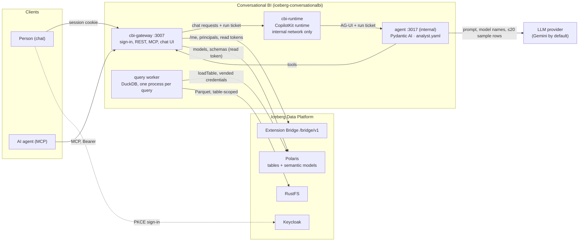
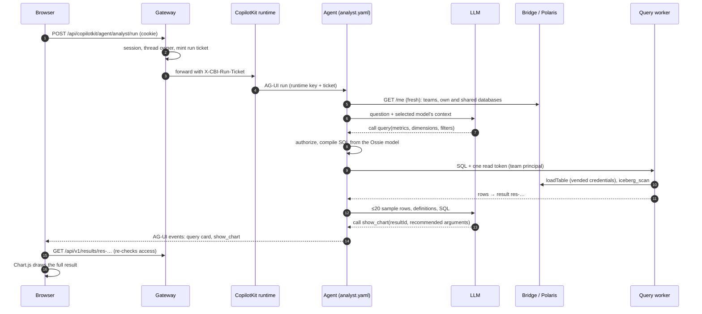

# Conversational BI for the Iceberg Data Platform

Ask questions about your data in a chat. Answers come from **governed queries** on Apache Ossie
semantic models: your teams' own models, and the models that other teams **share with your team**
through data shares. The model owner decides what a metric means, how datasets join and which
fields exist; the agent only picks names. Every answer shows the query it ran, the join path and
the metric definitions, and charts load their numbers from the result, never from the LLM.

This is an extension: its own Compose project (`iceberg-conversationalbi`), dependencies,
images, version and releases. It uses the platform only through the **Extension Bridge**
(`contracts/bridge` in the platform repository), Iceberg REST and S3.

| | |
| --- | --- |
| Chat | `http://localhost:3007`: CopilotKit v2 generative UI, Chart.js, Nothing design |
| Agent | Pydantic AI, defined in YAML ([`analyst.yaml`](conversationalbi/agent/analyst.yaml)), served over AG-UI |
| LLM | OpenAI, Anthropic, Google Gemini or Amazon Bedrock through `LLM_MODEL` in `llm.env` |
| API | `http://localhost:3007/api/v1` ([contract](contracts/conversationalbi-api/v1/openapi.yaml)) |
| MCP | `http://localhost:3007/mcp` (Keycloak sign-in through the `ext-conversationalbi-mcp` client) |
| Engine | DuckDB 1.5.5 with `iceberg_scan`, in a disposable, locked-down process per query |
| Bridge | contract `>=0.1,<0.2`; shared models need capability `shared-data` |

## Architecture



One question, step by step:



## Install

From the platform directory, register the extension. This creates its Keycloak clients and writes
the handshake file:

```bash
uv run python -m scripts.setup --extension conversationalbi --origin http://localhost:3007 \
  --handshake extensions/conversationalbi/.env.bridge
docker compose up -d --wait
docker compose -f compose.users.yaml up -d --wait users
```

Then in `extensions/conversationalbi`:

```bash
uv sync
uv run python -m scripts.setup        # asks for the model and its key; stored in llm.env (0600)
docker compose build && docker compose up -d --wait
```

Unattended, pass them instead: `LLM_MODEL=anthropic:claude-sonnet-5-5 ANTHROPIC_API_KEY=… uv run
python -m scripts.setup`. The release installer of the platform can also add this extension; see
`docs/install.md` in the platform repository.

A **team administrator** enables Conversational BI once per environment: the **Enable** button in
the chat's sidebar, or `enable_environment` over MCP. That creates the team's read-only service
account for that environment, which also reads the data shares the team received there.

For a demo on a platform set up with `scripts.setup --demo`, `uv run --all-groups python -m
scripts.flights_seed --own demo-demo` (platform directory) publishes the flights product in a partner team, shares it with demo-team, and gives
demo-team its own copy too.

Connect an AI agent to the MCP server:

```bash
claude mcp add --transport http --client-id ext-conversationalbi-mcp --callback-port 3010 \
  conversationalbi http://localhost:3007/mcp
```

## What it can read

| Model | You can ask about it when |
| --- | --- |
| In a database of one of your teams | you are a member of that team, in any role |
| Shared with one of your teams | one of your teams received the model **and every table it reads**, and enabled Conversational BI for that environment; that team's service account reads it |

Everything is re-checked on every question and when a chart loads its rows: a revoked share, a
table removed from it, an expired share or a removed membership ends access within 30 seconds.
Data is read with **read-only** tokens of the team's automation principal. Conversational BI never
writes to the platform.

## Governed queries

The `query` tool (and `POST /api/v1/queries`) takes names, not SQL:

```json
{"metrics": ["on_time_arrival_pct"],
 "dimensions": [{"field": "FLIGHT.date", "grain": "week"},
                {"field": "AIRPORT.code", "via": ["route_departure_airport"]}],
 "filters": [{"field": "FLIGHT.date", "op": "between", "value": ["2026-01-01", "2026-01-14"]}],
 "limit": 500}
```

- A metric belongs to the dataset its SQL reads (its *home*). Metrics of different homes go in separate queries.
- Joins follow relationships from the home, in their direction, and only onto the target's whole
  primary key. They can never multiply rows: a dimension that would (such as `RUNWAY.length` on
  flight metrics) is refused with `fan_out`.
- When a dataset is reachable in several ways, the shortest unique path wins; otherwise the
  query is refused with `ambiguous_join` and the options, and `via` picks one.
- Metric and field SQL from the model passes an allowlist of scalar and aggregate expressions:
  no queries, table functions, file readers or unknown functions. Values are always parameters.
- The worker binds exactly the tables it needs with `iceberg_scan` over the metadata Polaris
  returned, then disables local files and locks its configuration. It runs with a scrubbed
  environment, a 30-second limit and memory limits.

Every result also carries:

- `recommended`: the component that shows it best, decided from its columns rather than by the
  LLM. One metric without dimensions is a KPI, a time dimension a line, categories are bars
  (sideways for many or long names), and two category dimensions split the bars into series,
  stacked only when the metric adds up (a `SUM` or `COUNT`, never an average). Anything wider is a
  table. The agent follows it unless you ask for another view.
- `dataAsOf`: when the metrics' dataset was last committed, from the Iceberg snapshot the query
  read. Query cards and charts show it as *data as of*.

## What goes to the LLM

The LLM provider receives the conversation, the agent's instructions, the selected model's
names, descriptions and owner guidance, the compiled SQL, the metric definitions, and **at most
20 rows of each result** (`BI_LLM_ROWS`, capped at 8 KB). `BI_LLM_ROWS=0` sends no rows: the agent
still charts results, because charts and tables load their rows from the gateway. It never
receives tokens, credentials or rows beyond that sample. The owner's guidance is passed as quoted
data, never as instructions, and tools can only read what the person could read anyway.

Choose the provider per installation with `LLM_MODEL` (see [Configuration](#configuration)).

## Configuration

The LLM is set in `llm.env`, which `scripts.setup` writes (mode 0600) and only the gateway reads.
`LLM_MODEL` is a [Pydantic AI model string](https://pydantic.dev/docs/ai/models/overview); its
provider needs:

| Provider | `LLM_MODEL` | Variables |
| --- | --- | --- |
| Google Gemini | `google:gemini-3.8-flash` (the default) | `GOOGLE_API_KEY` |
| Anthropic | `anthropic:claude-sonnet-5-5` | `ANTHROPIC_API_KEY` |
| OpenAI | `openai:gpt-5.5`, `openai-chat:…` | `OPENAI_API_KEY`; `OPENAI_BASE_URL` for a compatible endpoint |
| Amazon Bedrock | `bedrock:global.anthropic.claude-sonnet-5-5`, `bedrock-mantle:…` | `AWS_BEARER_TOKEN_BEDROCK` and `AWS_REGION` |
| Claude on Bedrock, Anthropic client | `anthropic-bedrock:global.anthropic.claude-sonnet-5-5` | as Bedrock |

To change the model, edit `llm.env` (or run `scripts.setup` again with `LLM_MODEL` and its key)
and restart the gateway: `docker compose up -d --wait cbi-gateway`. A model that cannot start
(unknown, or without its key) does not stop the extension: `/api/health` reports it under `llm`, the
chat answers with what is missing, and the API and MCP server keep working.

For the other options see [`.env.example`](.env.example). The agent is [`conversationalbi/agent/analyst.yaml`](conversationalbi/agent/analyst.yaml),
a [Pydantic AI agent spec](https://pydantic.dev/docs/ai/core-concepts/agent-spec/): change its
instructions or model settings there. The `SemanticLayer` capability adds the data tools.

## Development

```bash
uv run pytest && uv run ruff check .          # gateway, agent, compiler, worker
(cd web && npm ci --ignore-scripts && npm test && npm run build)
uv run python -m tests.dev_server              # real gateway + agent, platform faked
(cd runtime && npm ci --ignore-scripts && RUNTIME_KEY=kkkkkkkkkkkkkkkkkkkkkkkkkkkkkkkk AGENT_URL=http://127.0.0.1:3017/ node server.mjs)
node scripts/cbi-browser.mjs                   # browser check against http://localhost:3007
uv run python -m scripts.api_contract          # after API changes
```

`LLM_MODEL=test:flights` with `BI_ALLOW_TEST_MODEL=1` replaces the LLM with a scripted agent for
tests and CI. `scripts/e2e_smoke.py` checks a live installation through MCP.

## Limits

Conversations live in the runtime's memory and end when it restarts. Results are kept for 30
minutes. One query reads at most 5,000 rows; `BI_MAX_ROWS` can lower that.

## License

Apache-2.0; see [LICENSE](LICENSE), [NOTICE](NOTICE) and [THIRD_PARTY_NOTICES.md](THIRD_PARTY_NOTICES.md).
