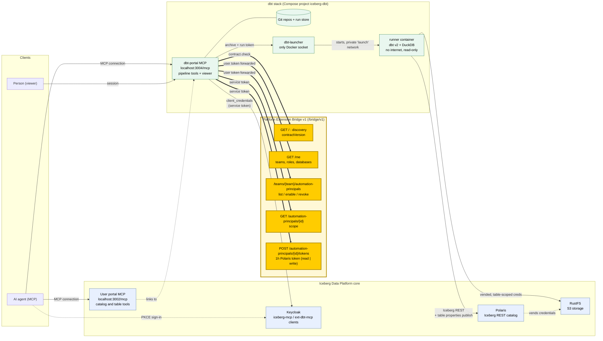
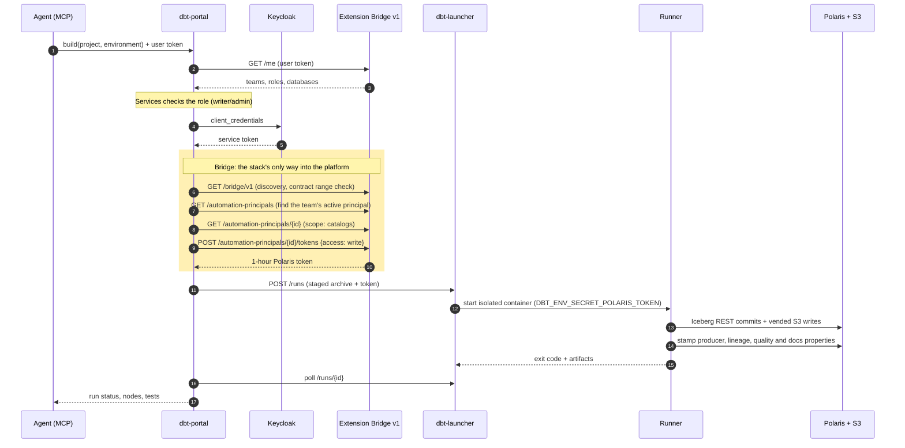

# dbt stack for the Iceberg Data Platform

dbt v2 pipelines for the teams of an Iceberg Data Platform installation. It is **API and MCP first**:
AI agents create projects, commit models, compile, build, test and schedule, and people watch
the pipelines in a read-only viewer.

This is an extension stack: its own Compose project (`iceberg-dbt`), dependencies, images, version
and releases. It uses the platform only through the **Extension Bridge v1** (`contracts/bridge` in
the platform repository), Iceberg REST and S3, so the platform and this stack upgrade independently.

| | |
| --- | --- |
| Engine | dbt v2 OSS 2.0.5 (Apache-2.0) with its built-in DuckDB adapter, DuckDB 1.5.5, Iceberg REST catalogs |
| API | `http://localhost:3004/api/v1` ([contract](contracts/dbt-api/v1/openapi.yaml)) |
| MCP | `http://localhost:3004/mcp` (Keycloak sign-in through the `ext-dbt-mcp` client) |
| Viewer | `http://localhost:3004` (pipelines, runs, schedules, docs) |

## Architecture

The stack reaches the platform core only through the Extension Bridge (highlighted), Iceberg REST and S3.



A build, step by step:



## How it works

- **Projects** belong to a team and are Git repositories kept by this stack. `main` is protected:
  writers commit to branches, and team administrators merge.
- **Runs** execute as the team's **automation principal** for one environment. Only a team
  administrator enables that (per environment). Each run receives a one-hour Polaris token from the
  Bridge, `write` for `build`/`run`/`seed` and `read` for everything else. Storage uses Polaris-vended,
  table-scoped credentials. The stack never holds a platform secret beyond its own Keycloak client.
- **Isolation.** A run is one container from the pinned runner image, started by the launcher (the
  only container with the Docker socket). The container has a read-only root, no capabilities and
  no internet. It sits on a private network with only the catalog and storage. Two builds of the
  same project and environment never overlap.
- **Promotion.** Development builds any branch. Acceptance and production build only revisions on
  `main`, and their schedules need a team administrator.
- **Pipelines** are drawn from dbt v2's Parquet information schema (`--generate-info-schema`), with
  each node's latest status and test results. After a build, each table gets the platform's
  producer, lineage and quality properties and its column docs, so the platform's catalog shows
  where it comes from.

| Role in the team | Can |
| --- | --- |
| reader | View projects, files, runs, schedules and pipelines; compile, preview and test |
| writer | Also create projects and branches, commit to branches, build in development, schedule development |
| admin | Also merge to main, enable environments, schedule acceptance and production |

## Install

From the platform directory, with the platform running:

```bash
uv run python -m scripts.setup --extension dbt --origin http://localhost:3004 --handshake stacks/dbt/.env.bridge
docker compose up -d --wait                                  # registers the dbt Keycloak clients
docker compose -f compose.users.yaml up -d --wait users      # the user portal links to dbt
cd stacks/dbt
uv run python -m scripts.setup                               # writes .env for this stack
docker compose --profile images build
docker compose up -d --wait
```

Then a team administrator enables dbt for an environment, either through an agent
(`enable_environment`) or with `POST /api/v1/teams/{team}/environments/development`.

## Connect an AI agent

Register both the user portal MCP and the dbt MCP. Use the user portal tools to discover
the team's databases and tables, and the dbt tools to build and manage pipelines.

```bash
claude mcp add --transport http --client-id iceberg-mcp --callback-port 3010 iceberg-user http://localhost:3002/mcp
claude mcp add --transport http --client-id ext-dbt-mcp --callback-port 3010 dbt http://localhost:3004/mcp
```

For GitHub Copilot in VS Code, add both servers to `.vscode/mcp.json`:

```json
{
  "servers": {
    "iceberg-user": {
      "type": "http",
      "url": "http://localhost:3002/mcp",
      "oauth": { "clientId": "iceberg-mcp" }
    },
    "dbt": {
      "type": "http",
      "url": "http://localhost:3004/mcp",
      "oauth": { "clientId": "ext-dbt-mcp" }
    }
  }
}
```

On first use, each server opens its Keycloak sign-in flow. Both act with the signed-in user's
permissions. [`skills/dbt-platform/SKILL.md`](skills/dbt-platform/SKILL.md) teaches an agent the
platform's conventions.

## Project conventions

- `schema` is the Iceberg namespace. `+catalog_name` picks the database by its display name, with
  `-` as `_`. A project runs unchanged in every environment.
- Use `+materialized: replace_table` (the platform materialization: rows are replaced in one Iceberg
  transaction, so the table keeps its identity, data shares and docs) or `incremental`. DuckDB
  cannot create Iceberg views. `table` recreates the table on every run.
- `profiles.yml` and `catalogs.yml` are generated for every run. `packages.yml` is not supported,
  because runs have no internet.
- Model and column descriptions become the table comment and column docs; tests become its quality
  status.

## Develop

```bash
uv sync
uv run pytest && uv run ruff check .
uv run python -m scripts.api_contract    # after an API change; review contracts/dbt-api/v1/openapi.yaml
```

The dbt docs site (`command=docs`, linked from the viewer) loads DuckDB-WASM from
cdn.jsdelivr.net in the browser.

Limits of 0.1.0: runs last at most 45 minutes (the platform token lifetime), and storage must be
reached through the platform's loopback S3 endpoint (the default). A received data share is not
readable by runs.
